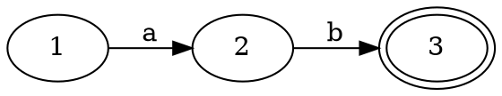
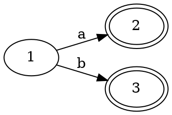
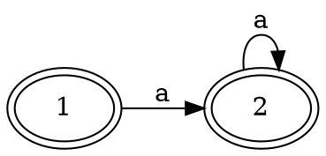

> concat

```dot
digraph {
rankdir = LR
3 [peripheries=2]
1 -> 2 [label="a"]
2 -> 3 [label="b"]
}
```

> union

```dot
digraph {
rankdir = LR
2 [peripheries=2]
3 [peripheries=2]
1 -> 2 [label="a"]
1 -> 3 [label="b"]
}
```
> star

```dot
digraph {
rankdir = LR
1 [peripheries=2]
2 [peripheries=2]
1 -> 2 [label="a"]
2 -> 2 [label="a"]
}
```
