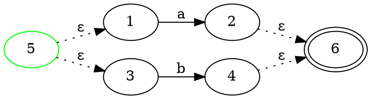
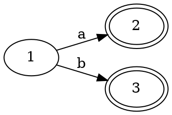
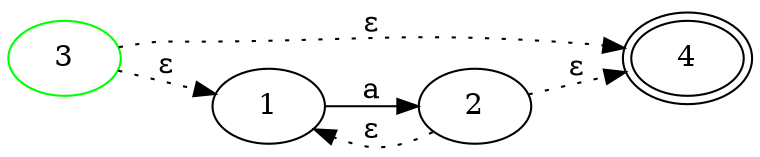
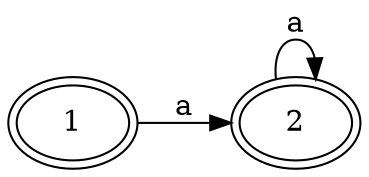
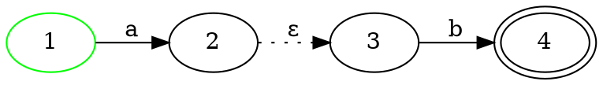
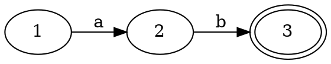
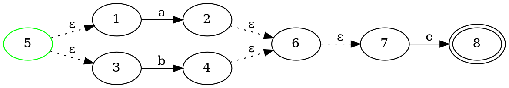
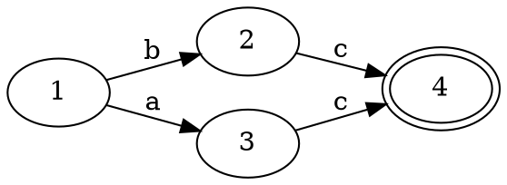
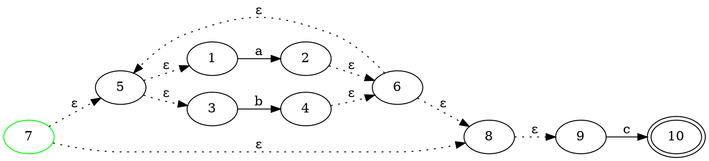

# a|b
- 正则表达式

a|b

- 后缀表达式

ab|

- 构建得到NFA



- 构建得到DFA :

# a*
- 正则表达式

a*

- 后缀表达式

a*

- 构建得到NFA



- 构建得到DFA :

# ab
- 正则表达式

ab

- 后缀表达式

ab^

- 构建得到NFA



- 构建得到DFA :

# (a|b)c
- 正则表达式

(a|b)c

- 后缀表达式

ab|c^

- 构建得到NFA



- 构建得到DFA :

# (a|b)*c
- 正则表达式

(a|b)*c

- 后缀表达式

ab|*c^

- 构建得到NFA



- 构建得到DFA :
```dot
digraph {
rankdir = LR
}
```
