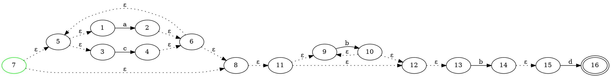
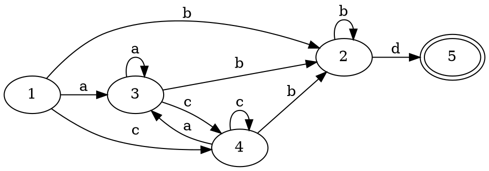
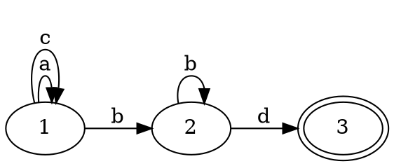

- 正则表达式

(a|c)*b*bd

- 后缀表达式

ac|*b*^b^d^

- 构建得到NFA

```dot
// Start State: 7
// Final State: 16
digraph {
rankdir = LR
7 [color=green]
16 [peripheries=2]
1 -> 2 [label="a"]
3 -> 4 [label="c"]
9 -> 10 [label="b"]
13 -> 14 [label="b"]
15 -> 16 [label="d"]
2 -> 6 [style=dotted, label="ε"]
4 -> 6 [style=dotted, label="ε"]
5 -> 3 [style=dotted, label="ε"]
5 -> 1 [style=dotted, label="ε"]
6 -> 8 [style=dotted, label="ε"]
6 -> 5 [style=dotted, label="ε"]
7 -> 5 [style=dotted, label="ε"]
7 -> 8 [style=dotted, label="ε"]
8 -> 11 [style=dotted, label="ε"]
10 -> 12 [style=dotted, label="ε"]
10 -> 9 [style=dotted, label="ε"]
11 -> 9 [style=dotted, label="ε"]
11 -> 12 [style=dotted, label="ε"]
12 -> 13 [style=dotted, label="ε"]
14 -> 15 [style=dotted, label="ε"]
}
```

- 构建得到DFA :

```dot
digraph {
rankdir = LR
5 [peripheries=2]
1 -> 2 [label="b"]
1 -> 3 [label="a"]
1 -> 4 [label="c"]
2 -> 2 [label="b"]
2 -> 5 [label="d"]
3 -> 2 [label="b"]
3 -> 3 [label="a"]
3 -> 4 [label="c"]
4 -> 2 [label="b"]
4 -> 3 [label="a"]
4 -> 4 [label="c"]
}
```

- 最小化DFA:

```dot
digraph {
rankdir = LR
3 [peripheries=2]
1 -> 2 [label="b"]
1 -> 1 [label="a"]
1 -> 1 [label="c"]
2 -> 2 [label="b"]
2 -> 3 [label="d"]
}
```
