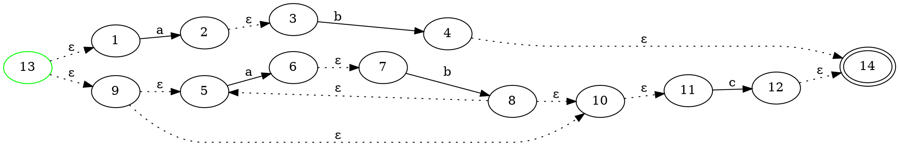
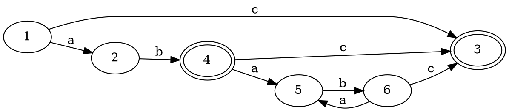
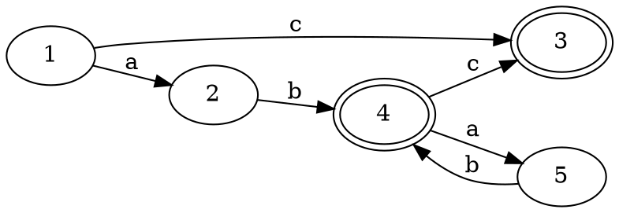

- 正则表达式

ab|(ab)*c

- 后缀表达式

ab^ab^*c^|

- 构建得到NFA

```dot
// Start State: 13
// Final State: 14
digraph {
rankdir = LR
13 [color=green]
14 [peripheries=2]
1 -> 2 [label="a"]
3 -> 4 [label="b"]
5 -> 6 [label="a"]
7 -> 8 [label="b"]
11 -> 12 [label="c"]
2 -> 3 [style=dotted, label="ε"]
4 -> 14 [style=dotted, label="ε"]
6 -> 7 [style=dotted, label="ε"]
8 -> 10 [style=dotted, label="ε"]
8 -> 5 [style=dotted, label="ε"]
9 -> 5 [style=dotted, label="ε"]
9 -> 10 [style=dotted, label="ε"]
10 -> 11 [style=dotted, label="ε"]
12 -> 14 [style=dotted, label="ε"]
13 -> 9 [style=dotted, label="ε"]
13 -> 1 [style=dotted, label="ε"]
}
```

- 构建得到DFA :

```dot
digraph {
rankdir = LR
3 [peripheries=2]
4 [peripheries=2]
1 -> 2 [label="a"]
1 -> 3 [label="c"]
2 -> 4 [label="b"]
4 -> 5 [label="a"]
4 -> 3 [label="c"]
5 -> 6 [label="b"]
6 -> 5 [label="a"]
6 -> 3 [label="c"]
}
```

- 最小化DFA:

```dot
digraph {
rankdir = LR
3 [peripheries=2]
4 [peripheries=2]
1 -> 2 [label="a"]
1 -> 3 [label="c"]
2 -> 4 [label="b"]
4 -> 5 [label="a"]
4 -> 3 [label="c"]
5 -> 4 [label="b"]
}
```
