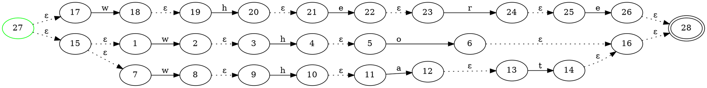
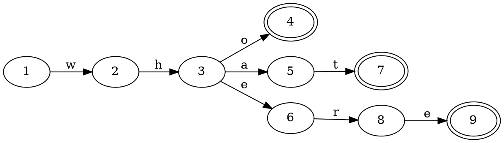
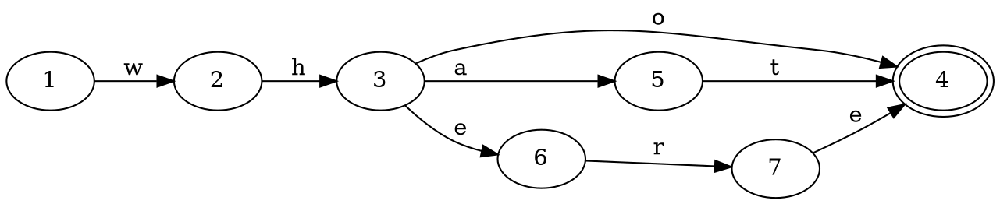

- 正则表达式

who|what|where

- 后缀表达式

wh^o^wh^a^t^|wh^e^r^e^|

- 构建得到NFA

```dot
// Start State: 27
// Final State: 28
digraph {
rankdir = LR
27 [color=green]
28 [peripheries=2]
1 -> 2 [label="w"]
3 -> 4 [label="h"]
5 -> 6 [label="o"]
7 -> 8 [label="w"]
9 -> 10 [label="h"]
11 -> 12 [label="a"]
13 -> 14 [label="t"]
17 -> 18 [label="w"]
19 -> 20 [label="h"]
21 -> 22 [label="e"]
23 -> 24 [label="r"]
25 -> 26 [label="e"]
2 -> 3 [style=dotted, label="ε"]
4 -> 5 [style=dotted, label="ε"]
6 -> 16 [style=dotted, label="ε"]
8 -> 9 [style=dotted, label="ε"]
10 -> 11 [style=dotted, label="ε"]
12 -> 13 [style=dotted, label="ε"]
14 -> 16 [style=dotted, label="ε"]
15 -> 7 [style=dotted, label="ε"]
15 -> 1 [style=dotted, label="ε"]
16 -> 28 [style=dotted, label="ε"]
18 -> 19 [style=dotted, label="ε"]
20 -> 21 [style=dotted, label="ε"]
22 -> 23 [style=dotted, label="ε"]
24 -> 25 [style=dotted, label="ε"]
26 -> 28 [style=dotted, label="ε"]
27 -> 17 [style=dotted, label="ε"]
27 -> 15 [style=dotted, label="ε"]
}
```

- 构建得到DFA :

```dot
digraph {
rankdir = LR
4 [peripheries=2]
7 [peripheries=2]
9 [peripheries=2]
1 -> 2 [label="w"]
2 -> 3 [label="h"]
3 -> 4 [label="o"]
3 -> 5 [label="a"]
3 -> 6 [label="e"]
5 -> 7 [label="t"]
6 -> 8 [label="r"]
8 -> 9 [label="e"]
}
```

- 最小化DFA:

```dot
digraph {
rankdir = LR
4 [peripheries=2]
1 -> 2 [label="w"]
2 -> 3 [label="h"]
3 -> 4 [label="o"]
3 -> 5 [label="a"]
3 -> 6 [label="e"]
5 -> 4 [label="t"]
6 -> 7 [label="r"]
7 -> 4 [label="e"]
}
```
