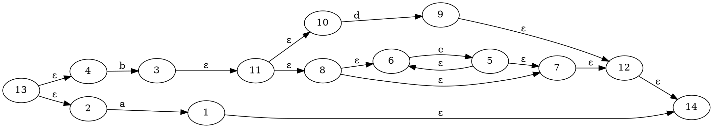

- 输入字符串 :

a|b(c*|d)
- 预处理并转成后缀表达式 :

abc*d|^|

==========================

- 构建得到NFA :

```dot
// Start State: 13
// Final State: 14
digraph {
rankdir = LR
13 -> 4 [label="ε"]
4 -> 3 [label="b"]
3 -> 11 [label="ε"]
11 -> 10 [label="ε"]
10 -> 9 [label="d"]
9 -> 12 [label="ε"]
12 -> 14 [label="ε"]
11 -> 8 [label="ε"]
8 -> 6 [label="ε"]
6 -> 5 [label="c"]
5 -> 6 [label="ε"]
5 -> 7 [label="ε"]
7 -> 12 [label="ε"]
8 -> 7 [label="ε"]
13 -> 2 [label="ε"]
2 -> 1 [label="a"]
1 -> 14 [label="ε"]
}
```
