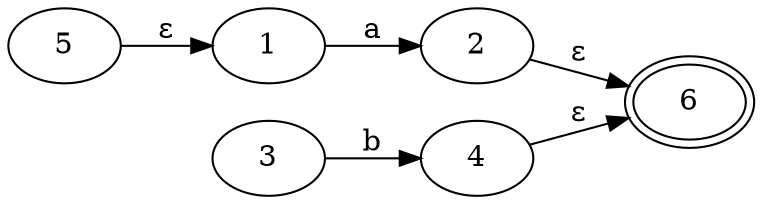

- 输入字符串 :
a|b

- 预处理并转成后缀表达式 :
ab|

- 构建得到NFA :

```dot
// Start State: 5
// Final State: 6
digraph {
rankdir = LR
6 [peripheries=2]
1 -> 2 [label="a"]
2 -> 6 [label="ε"]
3 -> 4 [label="b"]
4 -> 6 [label="ε"]
5 -> 1 [label="ε"]
}
```
